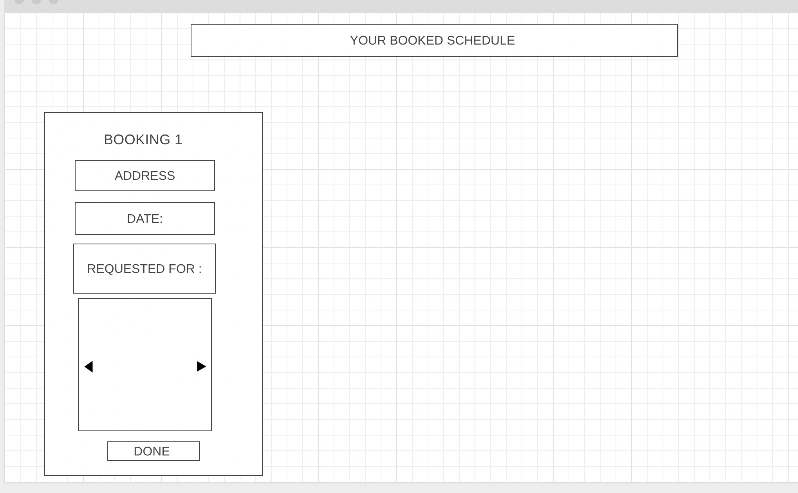

# Home-Space
Project Title : Home -Space 

Project Pitch - Home- Space is an online home services booking platform. The platform helps customers to book reliable and high quality services - Landscaping / electricians/ plumbers / home cleaning / painter

Project functionality- 

1. User need to login to use the services.
2. User will be able to select listed services. 
3. User will enter the  details in the form . Including images of the required work to be done and add 3 specific dates when the work can be done. 
4. Once the request is sent , Users then will be able to see the list of service provider in my requests- 
    1.  Along with their quoted price for the job. 
    2. Quoted date based on one of 3 dates provided by user. 
    3. Users will be able to see the rating/ reviews too for the service providers. 
    4. Once decided , users can confirm & pay for the service 
5. After the service is done Users will be able to submit review for the service 

Service Providers - 
- Will be able to register  as a  service provider. 
- Will be able to see the requests 
- In the request they will be able to the location of the customer based on google map
- They will be able to fill in the details for quotation
- Once the booking is confirmed . Service Providers will be able to see the booking confirmations on their dashboards.
- Once the service done they will mark the request as done. 

